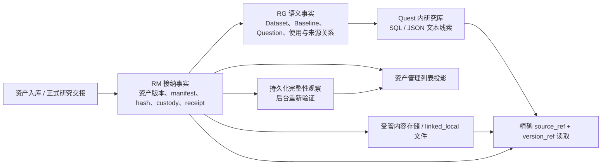

# 8768 后端：索引、检索与一致性事实调查

调查日期：2026-09-24。仅阅读源码与目录结构，未读取凭据、业务数据正文，未运行服务接口、迁移、测试或其他写操作。本文用于 wayfinder 决策建图，不替代运行时故障诊断，不决定未来实现。

## 证据范围

- 部署根：`<deployment-root>`。
- 主要代码：`source/src/meta_research/`。下文代码路径均相对此目录，行号来自此版本。
- 活跃环境：`release/envs/research-recorder-recovery-utf8-20260924/lib/python3.12/site-packages/meta_research/`。
- 已按文件字节确认以下 10 个文件在源码目录与活跃环境完全相同：`research_content.py`、`owners/research_memory.py`、`owners/research_datasets.py`、`owners/research_asset_content.py`、`owners/research_literature_content.py`、`owners/verified_content_pages.py`、`baseline_identity.py`、`database.py`、`web.py`、`projection.py`。
- 已阅读 `source/CONTEXT.md`；源码目录及部署祖先目录未发现适用 `AGENTS.md`。CONTEXT 将 RG 定义为全局可复用研究对象的含义与引用关系，将 RM 定义为实际内容、产物及资产版本，并明确文献主要按 Question 组织。

## 当前设计的主要结论

当前实现的中心是 **Owner 接纳事实 + 精确版本/收据 + 文件内容寻址 + 读取时组合**。资产列表、研究库搜索、文献正文定位清单是三种不同功能；代码中没有发现把所有资产转成统一全文或向量检索库的实现。

### 1. 事实库与派生读取

RM 的 `rm_assets`、`rm_asset_versions`、`rm_asset_custodies` 分别存身份、精确版本与保管方式。版本保存 `content_hash`、`manifest_json/hash`、`provenance_json/hash` 和接纳收据；版本接纳与 custody、intake 完成状态、Owner revision、durable feed 写入同一数据库事务。见 `owners/research_memory.py:4076–4268`。

资产管理列表 `query_asset_projection_inventory` 直接联结版本事实与最后一次持久化校验观察，分页只读取元数据，不扫描正文。它不是独立维护的搜索数据库。见 `owners/research_memory.py:4486–4556`。`projection.py:708–768` 再加入当前页对应的 roles、holds、release assessments，并核对资产角色和版本的绑定。

整页快照在 SQLite `read_snapshot()` 下读取，嵌套 Owner 查询共享同一 WAL 快照；缓存只存在于该读取快照内，返回深拷贝。见 `projection.py:365–383`、`database.py:40–59`、`read_snapshot_cache.py:1–23`。数据库启用外键、WAL、`synchronous=FULL`，写操作由本进程可重入锁和数据库事务保护。见 `database.py:62–90,96–102`。

### 2. “索引”实际包含哪些东西

| 名称/入口 | 当前实现 | 内容范围 |
|---|---|---|
| SQLite 索引 | 迁移中的普通关系索引和唯一约束 | 版本、角色、引用、时间、状态等键；不是语义检索 |
| 资产 inventory | `rm_asset_versions` 联结持久化校验观察，再分页 | 全实例资产版本元数据，无 query 参数 |
| Question 搜索 | `instr(lower(COALESCE(...JSON...)), lower(query))` | 当前 Quest 的 Question 内容 JSON |
| Baseline 搜索 | `instr(lower(forward_contract_json), lower(query))`；也支持精确 method hash | 当前 Quest 方法描述；返回候选，不自动合并 |
| Dataset 搜索 | `instr(lower(payload_json), lower(query))` | 当前 Quest 已建立引用的数据集语义事实 |
| Literature 搜索 | 分页取当前 Question revision 的记录，再对 paper 元数据 JSON 作 Python casefold 子串过滤 | 当前 Quest、每个 Question 的当前文献 revision；不是全文正文 |
| `fulltext-index/v2` | 不可变 JSON 列表，记录 paper URL、media type、content hash 与正文对象 path/hash/size | 精确正文定位与校验，非倒排全文索引 |

证据：`research_content.py:116–176`、`baseline_identity.py:260–284`、`owners/research_datasets.py:238–279`、`owners/research_memory.py:8646–8685`。在 `src/meta_research/**/*.py` 及迁移中检索 FTS4/FTS5、embedding、vector、BM25、semantic_search 等术语，未发现相应检索实现；此结论限于所查源码，不是对所有部署外部服务的全面排查。

`fulltext-index/v2` 与 summary/papers metadata 都按内容 hash 保存，并由 snapshot DB 行保存精确对象路径和 hash；读取元数据会重新验证小型索引及接纳权限。正文另外保存为 UTF-8 的按 hash 寻址对象。见 `owners/research_memory.py:8955–8999,9153–9165`、`owners/research_literature_content.py:14–50`。

### 3. 查询入口与可见范围

| 入口 | 范围与行为 | 证据 |
|---|---|---|
| Web research library | 要求有效 `quest_ref`；分 questions/literature/baselines/datasets/human 五个入口 | `web.py:2310–2353` |
| `GET /api/v1/research-assets` | 无 Quest 参数，返回全实例资产 inventory 页 | `web.py:2359–2369` |
| `GET /api/v1/research-assets/roles` | 可选 Quest/role，基于 revision 重试保护分页一致性 | `web.py:2411–2442` |
| Semantic MCP `research_graph.questions.page` / `research_memory.literature.page` | 从 root runtime scope 推导 Quest | `research_content.py:13–20,179–204` |
| MCP `research_graph.baselines.page/read`、`research_graph.datasets.page/read` | handler 使用当前 Quest 范围 | `semantic_owner_gateway.py:368–396,550–568,620–633` |
| MCP `research_memory.content.read` | 精确 source/version 绑定，再按类型核对 Quest 和已接纳来源 | `research_content.py:23–94,186–194` |

Dataset 的身份和版本从数据模型上可复用，但 scoped 查询要求当前 Quest 的 Question 已有 DatasetReference；资产内容读取还要求在该 Quest 已接纳资产 role 或已提交 Target completion manifest 中存在该精确版本。Dataset 身份本身不授予跨 Quest 内容使用权限。见 `owners/research_datasets.py:182–220`、`research_content.py:48–56`。

因此，“系统存了什么”“当前 Quest 能发现什么”“某个运行能正式作为输入采用什么”是现有实现中的不同边界。现状并不等于已经实现跨 Quest 全局研究资产搜索。

### 4. 更新触发、恢复与一致性

1. **普通关系索引随事务维护。** 各 Owner 写入事实后，读取侧直接查询最新事实，并无独立统一全文索引更新队列。
2. **入库可恢复。** RM 初始化把 `processing` intake 置回 `queued`；后台也会回收过期 processing lease，再按 next attempt 时间处理。见 `owners/research_memory.py:3155–3165,3486–3512`。
3. **完整性观察是异步投影。** 迁移为历史版本补 `unknown` 观察，并安装 asset version 插入触发器。入库完成后设为 verified/available，后台逐个深验到期版本；写观察之前比较当前版本/custody basis hash，变化则重新排队。见 `migrations/versions/0006_research_asset_recovery.py:392–409`、`owners/research_memory.py:3514–3648,4204–4219`。
4. **验证间隔按体积增加。** 默认 300 秒，较大 corpus 按体积延长，上限 7 天；公开 inventory 展示最后持久化状态。见 `owners/research_memory.py:188–203,4486–4556`。成功复验而状态不变时，`observed_at` 保留旧值；它不能直接解释成“最近一次校验时间”。见 `owners/research_memory.py:3606–3628`。
5. **文件先稳定落盘，再接纳数据库事实。** 受管对象先校验 hash、写临时文件、fsync、原子 replace、fsync 目录；接受前核验 managed manifest 或 linked_local 来源仍匹配。见 `owners/research_memory.py:4042–4076,6043–6123`。这提供了明确的内容接纳边界，但文件系统和 SQLite 并非同一个原子事务。
6. **精确读取不把历史接纳等同于当前文件存在。** 每页验证元数据/收据并打开实际文件；文件签名首次出现时全量 hash，之后仅在签名未变时读取局部字节。签名含 inode、size、mtime、ctime 和预期 hash，缓存为有限 LRU、进程重启后消失。见 `owners/research_asset_content.py:12–81`、`owners/verified_content_pages.py:12–82`。大型文件第一页可能仍承担完整校验 I/O，后续页才获得收益。

在本次检索中未发现面向统一搜索投影的 rebuild/reindex 管理入口。现有 `Projection` 自称可从五类 Owner snapshot 重建，实质为查询时组合；文献 fulltext index 属于接纳的不可变 snapshot 内容，不宜直接当作可丢弃搜索缓存。未核实真实部署的孤立内容对象数量、校验积压、查询延迟，也没有运行故障恢复实验。

## 待讨论的 5 项决策与风险

以下项目是建图输入，均不预先选定方案。除明确的代码行为外，影响仍需结合预期用法或运行数据验证。

| 决策 | 代码事实 / 可能影响 | 需要用户明确的选择 |
|---|---|---|
| 1. 检索对象与覆盖范围 | 当前研究库按五类实体和 Quest 发现，资产 inventory 另列；文献只搜索 paper metadata，不搜全文正文。直接采用“已有索引”容易误以为内容都可发现。 | 首要任务是找已知版本、按研究对象浏览、跨项目复用，还是在所有正文中找证据？哪些内容必须可被搜索？ |
| 2. 跨 Quest 复用边界 | 全局身份概念与当前 Quest 的发现/采用权限分开；Dataset scoped 查询依赖现有 reference，Baseline 列表也按 Quest。当前并非全局可搜索后显式采用的完整流程。 | 是否允许先跨 Quest 发现元数据，再正式建立引用/采用？哪些材料仍只在原 Question/Quest 可见？ |
| 3. 关键词与分页语义 | 文献先分页、后过滤 query；可能返回空 items 但仍有 next_offset，匹配项在后页。Question、Dataset、Baseline 用 JSON 子串，字段与排序没有统一相关性语义。 | 搜索是否承诺当前页就是“匹配结果页”？是否需要字段搜索、匹配原因、相关性排序与一致的分页契约？ |
| 4. 校验新鲜度与读取成本 | inventory 用持久化观察；实际消费按精确版本校验。复验周期按大小最多延到 7 天，未变状态的 observed_at 不更新，首次精确页读取全量 hash。 | 用户界面应分别展示“历史接纳”“内容当前可用”“最近检查”和“下一次复验”吗？大型数据允许何种延迟与 I/O 预算？ |
| 5. 可重建投影与保留事实的边界 | 关系读投影可重算；fulltext-index 是已接纳 snapshot 清单；文件先于 DB 写入。未见统一搜索索引重建或通用对象对账/回收流程。不能因此断言已有数据丢失。 | 未来哪些索引可以随时删掉重建，哪些定位清单必须永久保留？是否需要显式的重建、对账、积压监控和孤立对象回收能力？ |

## 可用的现有验证线索

源码测试中已有精确 Quest scope、fence、linked_local 漂移/缺失、DeepFetch snapshot 精确读取等用例，例如 `tests/test_research_content_reader.py:24,46,70`；另有 `tests/test_public_research_assets.py`、`tests/test_large_target_inputs.py`。本轮没有运行这些测试，因此不将测试存在视为当前服务通过验证。
