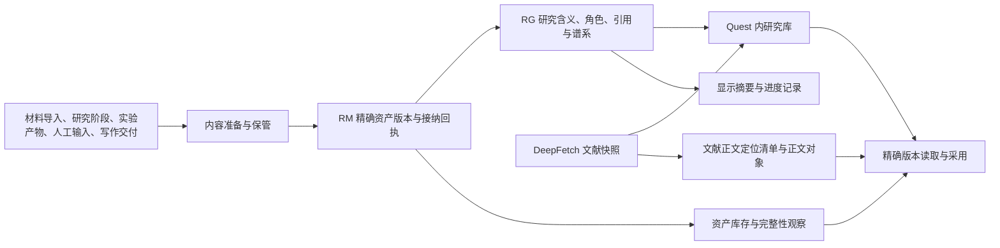
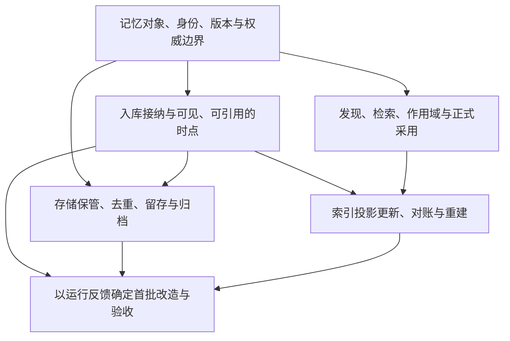

# 8768 记忆系统：入库、存储、索引与使用

本轮目标是整理 meta-research 整套记忆系统的现状、问题和决策依赖，再与研究负责人逐项讨论。实际研究产物和运行统计作为检验设计的反馈。本轮不改变 8768 的运行实现或迁移研究数据。

## 当前机制

**现状的优势**：内容 hash、精确版本、幂等接纳、研究含义和内容保管已有边界。优化应先明确这些边界如何对外表现，再决定哪些实现需要合并。

**现状的主要困难**：所谓“记忆”分布在资产、文献快照、领域事实、引用关系和显示摘要中；不同入口生成身份、建立版本、进入目录和获得研究用途的方式并不完全一致。

## 已证实的事实与待验证的影响

| 事实 | 对设计的影响；尚不等于已复现故障 |
|---|---|
| 通用 intake 可向既有 Asset 追加版本；阶段内容常新建 Asset/version 1；Dataset 另有领域身份 | 必须定义同一记忆的修订、派生、复制和复用，不能仅靠 hash 或版本号推断 |
| RM 入库接纳、RG 角色/正式证据接纳、Target 收口可以分步发生 | “已保存”“可找到”“可正式引用”需要不同、可解释的状态 |
| 文献快照有专用存储；显示摘要有独立数据库 | 统一发现目录不必要求所有对象使用同一写入合同，但需明确覆盖范围与权威来源 |
| 资产库存是全实例元数据页；研究库发现和内容采用主要受 Quest 范围约束 | 发现权限、正式采用和全局复用应单独定义 |
| 未发现统一全文或向量检索；fulltext-index/v2 是正文定位清单 | 不能以已有“索引”名称推断系统已支持正文检索；先定义找什么和如何采用 |
| 文献 query 在 SQL 分页后过滤 | 搜索页可能为空而后页仍有匹配；需明确匹配结果分页合同，再做有界复现 |
| 文件先落盘再接纳 DB；intake 可恢复；完整性观察异步更新 | 后续应明确崩溃中间态、对账对象以及可重建投影，不能把所有中间态都当坏数据 |
| 有 hold 和释放资格评估，未找到通用正式 GC 执行闭环 | 留存/归档需求应先于物理回收实现；本轮不执行清理研究数据 |

详细源码证据见 [资产与写入调查](asset-inventory.md)、[索引与一致性调查](index-inventory.md)。静态分析与实际运行反馈分别记录，避免把推断写成线上故障。

## 建议的决策依赖

这些是需要讨论的决策，不是预先选定的实现任务。GitHub 地图及原生子 issue 是后续状态的权威入口，本文件只保存建图时的事实与结构。

第一轮应从一个具体场景开始：同一份研究材料经过修订、数据处理和再次使用后，系统应让人和 Agent 看到几个对象、哪些版本，以及哪些来源关系？答案会约束后续的入库和索引设计。
