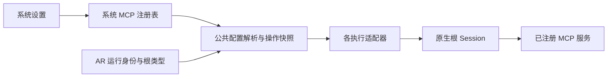

# 系统 MCP 注册与根 Session 注入 Spec

状态：实现草案。本文记录已确认的产品边界，并给出首期实现默认值；尚未实现或部署。

日期：2026-09-26。现状依据为本次只读核对的 8769 远端源码及对应安装文件。远端分支为 `v1-enginer`，HEAD 为 `c7ee625`，存在未提交修改；不能仅以此 commit 还原当前部署，也不能用落后的本地副本覆盖远端。

## 1. 要解决的问题

用户希望在 meta-research 中注册任意具体用途的 MCP 服务，使选中的根 Session 在启动和后续执行时稳定获得这些工具。例如，摄像头 MCP 可以给会话提供画面，而摄像头接入、SDK 封装和设备控制由独立的实现负责。

这属于当前 meta-research 部署实例共享的系统运行能力，不修改用户机器上其他 Codex 实例的全局配置。Question、Baseline、HumanRequest、Literature、Dataset、Environment 六大入口组织研究内容；注册或使用系统 MCP 无需创建、关联或发布这些研究对象。工具结果后来成为研究材料时，继续使用既有研究记录和资产机制。

首期完成标准：用户通过系统设置注册一个 MCP 后，所有适用的生产根 Session 都能实际发现并调用其工具；配置修改有明确的生效边界，原生会话可以继续，既有执行可以恢复。

## 2. 已确认的范围与首期默认值

### 用户已确认

- 系统提供统一的 MCP 注册与注入机制，具体 MCP 的工具、设备和业务连接实现由另一套设计负责。
- 所有根 Session 都具备注入能力；每个 MCP 默认适用于全部根类型，也允许按根类型选择范围。
- 注册配置保存后，新建 Session 的首次模型调用，或原 Session 在上一逻辑操作结束后的下一次模型调用，读取最新配置。无需为此重新部署、重启 meta-research 或另建 Session；首期不要求执行中即时热插拔。同一未决操作的崩溃恢复仍沿用原配置，详见第 7 节。
- 原生会话上下文应保留。不同执行适配器继续在 AR 的运行体系下工作，共用 MCP 注入逻辑。
- 本次先完成注册能力，不重构整个研究执行系统，不扩展六大研究入口。

### 本 Spec 提出的首期默认值

- 覆盖当前生产 Codex 后端；支持声明 `stdio` 和 Streamable HTTP 连接，由原生运行器连接服务。
- 管理入口为系统设置及对应管理 API，使用现有管理入口的访问机制。
- 外部 MCP 默认是可选能力：连接失败有界返回并显示状态，不改变内部研究 MCP 的关键依赖语义。
- 采用统一注册表和公共配置构建器。首期不增加工具调用代理，不实现自定义 MCP 协议客户端。
- 原生子会话按原生运行器的能力沿父操作继承工具配置，本期不为子会话增加独立注册策略；继承行为需验证。

这些默认值是实现提案，不应被描述为此前已经实现的功能或用户逐项确认过的细节。

## 3. 当前基础与缺口

| 项目 | 核对结果 |
| --- | --- |
| AR 管理运行身份、权限范围和生命周期 | 已有，Target、DeepFetch 同样处于该体系下 |
| 内部 `meta_research` MCP 及原生 Session 启动、继续、恢复 | 已有，可复用 |
| 任意外部 MCP 的统一注册、持久化、启停、适用范围 | 需要新增 |
| 各执行路径共用的系统 MCP 配置构建 | 需要新增并接入 |
| 外部 MCP 管理界面、连接检查和状态展示 | 需要新增，现有内部诊断不能替代 |

当前底层启动参数分散在 Idea 基类、Target Harness 和 DeepFetch 中。这是实现分布，不是三套会话管理权。DeepFetch 的 direct、durable 路径还存在只在内部 semantic MCP 可用时才清理 MCP 配置的条件分支。系统 MCP 配置不能依赖内部通道是否启用。

## 4. 系统职责与接口



AR 运行支撑层统一提供配置选择和操作快照；执行适配器负责将同一结果编译为原生运行器参数。注册表存储位置和模块命名可按现有架构选择，必须只有一个权威配置来源。

公共接口至少表达以下能力，具体函数名可调整：

| 能力 | 输入与结果 |
| --- | --- |
| 管理注册项 | 新建、读取、修改、启用、停用、移除；返回配置修订及校验错误 |
| 为新操作解析配置 | 根据真实根类型、当前注册修订、内部通道构建不可变的有效配置快照 |
| 读取既有操作快照 | 按操作身份取得当时配置，供同一操作恢复和结果对账 |
| 编译原生配置 | 合并内部通道和系统 MCP，生成运行器需要的参数及单独传递的敏感环境 |
| 查询接入状态 | 区分注册配置、某次操作的装载情况、实际连接检查结果 |

注册表修改由用户管理操作触发；首期不新增研究 Agent 自主修改系统注册表的工具。管理操作不会启动研究或调用设备业务工具。

## 5. 注册配置合同

每项配置至少包含：

| 字段 | 语义 |
| --- | --- |
| `server_id` | 稳定、唯一的服务标识；修改显示名不会改变工具命名空间 |
| `display_name`、`description` | 用户识别服务的名称和说明 |
| `enabled` | 是否参与后续新操作的配置选择 |
| `scope` | `all` 或明确的 `root_kinds` 集合，默认 `all` |
| `transport` | `stdio` 或 `streamable_http` |
| 连接配置 | 按 transport 校验的启动命令或远端连接信息 |
| `revision` | 每次成功修改产生的配置修订，支持关联实际生效情况 |

连接配置规则：

- `stdio` 声明命令、参数数组、可选工作目录和环境变量配置。采用参数数组，不将用户输入拼成 shell 命令。工作目录有稳定的绝对解析结果，不随研究 Target 的工作目录隐式变化。
- HTTP 声明服务 URL、可选普通请求头及认证环境变量引用。首期认证使用部署侧环境变量引用；不新建 OAuth 登录或密钥管理系统。
- 普通环境参数与敏感值引用分开。敏感引用在执行主机解析；管理返回、提示词和普通日志不回显其值。外部服务不能获得内部研究 MCP 的会话凭据。
- 配置表达的是 meta-research 执行主机上的命令、路径和连接。8769 的 `localhost` 是服务器本身，浏览器所在电脑的设备连接由外部方案提供。
- 内部 `meta_research` 名称保留。外部服务生成稳定、无冲突的原生命名空间；重名、覆盖内部服务、未知根类型、互斥字段或无效参数在保存前拒绝。
- `scope=all` 根据权威根类型集合解释，自动包含未来新增且已接入公共机制的根类型；显式列表只包含所选类型。显式类型集合不能为空，临时关闭使用 `enabled=false`。
- 网络不可达与配置格式错误分开：合法配置可在服务暂时离线时登记。
- 配置保存应原子、持久。修改失败保留此前有效配置；管理端发现修订冲突时明确提示，不静默覆盖其他修改。

示例为数据形状说明，实际 API 命名可调整：

```json
{
  "server_id": "camera",
  "display_name": "实验室摄像头",
  "enabled": true,
  "scope": { "mode": "all" },
  "transport": "streamable_http",
  "connection": {
    "url": "https://camera.example.invalid/mcp",
    "bearer_token_env_var": "CAMERA_MCP_TOKEN"
  }
}
```

停用和移除会阻止后续新操作选择该服务；不会取消正在执行的操作。移除当前注册项仍须保留恢复未决操作所必需的受控快照，不要求构建完整配置审计系统。

## 6. 所有根 Session 的覆盖合同

以 `root_capabilities.py` 的 `ROOT_AGENT_KINDS` 为权威集合，不在注册功能另建一份会逐渐分叉的类型定义。此次核对共有九种：

| 根类型 | 当前生产入口／需要覆盖的位置 |
| --- | --- |
| `idea` | Idea provider 与公共调用基类 |
| `plan` | Plan provider 与公共调用基类 |
| `bundle` | Bundle provider 与公共调用基类 |
| `reasoning` | Reasoning provider 与公共调用基类 |
| `writing` | Writing provider 与公共调用基类 |
| `companion` | 协作助手；默认 Quest 草拟与 intent 也使用此 provider |
| `acquisition` | 材料获取使用的内部适配器及公共调用基类 |
| `target` | Target Harness 的原生启动及恢复 |
| `deepfetch` | DeepFetch 的 direct、durable 调用路径 |

按各类型真实可达的 `initial / wake / resume / successor / recovery` 入口验证，并包含 primary、review、continuation 等内部调用变体。枚举中出现的新根类型必须进入覆盖检查；不能仅因改过三个文件就宣称覆盖全部根 Session。

选择规则：已启用且范围匹配的服务注入；未匹配的服务不进入本次原生工具配置。Bundle 的类型选择不会隐式替代独立 Target 的类型选择。共享启动基类的各调用方必须传入真实根类型，不能全部退化成 `idea`。

内部研究 MCP 保留其原有凭据、作用域与 required 行为。系统 MCP 可以在没有内部 semantic 通道的合法会话路径中独立装载。以受控生成的完整配置避免意外继承执行主机其他账号或工作目录里的 MCP 配置。

首期支持承诺限定为当前生产 Codex 路径。现存 Claude Harness、可替换旧 DraftingAdapter 等非默认后端应明确标注未纳入本期，配置功能不能在这些后端静默显示已生效。

## 7. 配置生效与恢复语义

这里的生效边界是“下一次新的逻辑 provider 操作”，不是下一次系统部署，也不是必须新建 Session。首次上线本功能需要正常部署；功能上线后，注册表的新增、修改、启停和范围调整在保存后自动供后续新操作读取，无需重新部署或重启 meta-research。外部 MCP 服务及部署侧凭据的安装、启动或变更另按其自身运维方式处理。

例如：协作助手已经完成一轮回复，用户登记一个 MCP，再向同一会话发送消息；下一次调用沿用原生 Session 和上下文，同时装载新配置。若一个 Target 正处于持续执行中，保存配置不会中途替换它的工具集合，而是等待该逻辑操作结束后的下一次新调用。

“恢复”必须区分两个边界：

| 场景 | 使用的配置 |
| --- | --- |
| 新建根 Session 的第一个逻辑 provider 操作 | 开始该操作时的最新有效配置 |
| 已完成上一操作，继续同一原生 Session 的下一次逻辑操作 | 最新有效配置，保留原 `native_session_ref` |
| 同一未决操作的重连、崩溃恢复、执行接续或结果对账 | 该操作原先冻结的配置快照 |
| 正在执行的操作期间修改注册表 | 不热改该操作，变更等待后续新操作 |

操作快照至少关联注册修订、根类型、选中服务及其有效配置标识，并参与该操作的持久化与一致性验证。敏感值不进入普通快照输出或提示；私有执行材料按既有受保护的传输约定管理。外部凭据已失效时如实报告，不能通过创建新研究会话伪装成恢复成功。

可变注册配置不得直接加入整个研究 Run 的长期能力绑定，使一次服务修改导致原会话失效。实现能力和合同版本可以进入长期绑定；每次选中的 MCP 配置在 provider 操作层单独冻结。

修改、停用、移除或缩小范围后，下一次新操作不得残留已不适用的工具；新增或扩大范围后的新操作应能发现新工具。必须用真实原生 resume 验证，不能仅检查新 argv。

恢复兼容要求：

- 尚未存在系统 MCP 字段的历史操作保持原恢复合同。兼容读取不得把当前注册项补进旧操作，也不能改变已有 invocation hash 或已封存 argv。
- 同一操作的重复对账不重复运行已完成的工具或新建原生 Session。
- DeepFetch 同一逻辑操作内的多个恢复 segment 共用原快照，完成后的下一逻辑操作才采样最新配置。
- 原生子会话使用父操作的配置；不在子会话创建时重新采样注册表。若原生运行器无法继承，应报告实际限制，不能声称已覆盖。

## 8. 调用与失败行为

系统注册层不理解摄像头、机器人或研究任务语义。具体连接、MCP 握手、工具发现和调用交给原生运行器；保留外部工具原本的 schema、命名空间和返回内容。

文本、结构化结果和图像等原生支持的内容走外部 MCP 的原生通路，不强制经过内部 `SemanticMcpGateway` 的文本 JSON 包装。对当前运行器不支持的内容明确暴露限制。

外部 MCP 首期默认非 required，连接和工具发现采用有限超时；实现提供可检查的默认超时和允许范围，测试以该上界断言。一个服务离线、进程启动失败或认证失败，不应使健康服务与根 Session 的其他能力不可用；也不应自动产生 HumanRequest、暂停整个 Quest 或反复重启会话。

注册表自身读取失败与单项服务离线分开处理。新操作无法取得一致配置时明确报告配置装载失败，不将异常解释成空注册表后静默启动；既有未决操作仍可使用其有效的冻结快照恢复。保存失败不影响已开始的操作。

工具调用失败返回真实错误，由当前研究或交互逻辑判断后续。注册层不自动重放可能已执行的设备动作。用户停用注册项不是停止设备的命令，设备取消与并发控制属于具体 MCP 的设计。

meta-research 不负责安装、升级或常驻托管外部服务。原生运行器按 stdio 配置启动子进程属于正常连接行为；全局注册一项不意味着所有 Session 共用一个服务进程。

## 9. 最小管理界面与状态

系统设置增加 MCP 管理入口，提供列表、新建、编辑、启用／停用、移除、范围选择，以及连接状态。原生运行器支持无业务调用探测时提供连接检查。连接字段可按 transport 显示，默认范围为“全部根会话”。首期无需独立的监控控制台。

连接检查复用锁定版本的原生运行器已有的无业务调用探测能力，只做启动、握手和工具发现。检查使用与实际运行同源的连接配置和执行环境，提供有限超时；临时检查进程及时清理。若该版本没有此类探测能力，界面明确显示“独立连接检查未支持”，以实际会话中取得的连接证据为准；不能为检查按钮另建 MCP 客户端，或让模型自主试调用设备。

状态必须区分：

| 层次 | 可以展示的事实 |
| --- | --- |
| 注册状态 | 配置已保存、启用／停用、适用范围和当前修订 |
| 操作装载状态 | 某根 Session／操作选中了哪些服务、实际注入了哪个修订 |
| 连接状态 | 某次检查或运行时握手／工具发现的成功、失败、未检查或未知，以及时间与错误摘要 |

配置已写入不能显示为连接成功。单独检查成功不能显示为所有 Session 都已可用。底层没有提供握手证据时显示未知，不能从退出码或配置文件存在推测成功。配置更新后的旧检查结果应标记所属旧修订。

页面说明变更将在后续新操作生效；当前未决操作仍使用原配置。现有内部研究 MCP 可作为只读系统项展示，不能通过外部注册管理操作删除或覆盖。

## 10. 实现落点与边界

实现前重新核实远端工作树、生产路径与已有改动。以下为本次读到的入口，函数名比行号稳定：

| 文件／入口 | 本次需要处理的内容 |
| --- | --- |
| `root_capabilities.py`、AR 运行支撑层 | 权威根类型、统一配置解析与操作快照；保持既有研究权限合同 |
| `composition.py` | 向生产 provider 和 Harness 注入同一注册／解析能力 |
| `harness_adapters.py` 的 `CodexHarnessAdapter._argv` | Target 系统 MCP 合并、操作身份及恢复 argv 一致性 |
| `idea_skill.py` 的 `_invoke_once`、durable invocation | 公共基类内注入；使用真实根类型，扩展并兼容原操作封存合同 |
| `deepfetch.py` 的 `_invoke_with_access`、`_durable_argv`、恢复 payload | direct/durable 同时覆盖；系统配置不依赖 resident channel；兼容严格键集合验证 |
| `web.py`、前端系统设置 | 管理 API、表单、状态与错误呈现 |

优先共享配置选择、校验、命名和编译逻辑。各适配器保留业务执行、产物和生命周期差异；本期不要求将所有 CLI 执行器合成一个。

## 11. 验收标准

以下条件满足其明确的适用范围才可称为实现完成。测试使用专用 MCP fixture，不依赖真实摄像头或设备；原生运行器的已确认限制单独记录，不能误报为注册模块已经支持。

1. **持久化管理**：新增、修改、启停、移除和范围配置重启后仍正确；无效配置、命名冲突和修订冲突不会破坏此前配置。
2. **全根覆盖**：按权威根类型及真实可达入口建立矩阵，验证所有生产路径拿到正确系统 MCP；特别包含 acquisition、writing、companion 草拟入口与 DeepFetch direct/durable。空注册表保持当前行为。
3. **范围准确**：默认 all 对全部根类型可用；选择性范围不会泄漏到未选类型；同一公共基类的不同根类型正确区分。
4. **真实调用**：stdio 和 HTTP fixture 在实际托管 Codex 中完成工具发现及一次确定性工具调用，不以参数字符串匹配替代端到端验证。
5. **原生内容通路**：对原生运行器已支持的内容类型验证完整透传。若锁定版本支持 MCP 图像，fixture 返回已知测试图像并验证模型实际可见；不以收到 base64 字符串或文件路径作为“看到了图像”的证据。运行器缺失的多模态能力作为已确认限制交付，本期不补造协议或模型通路。
6. **原会话继续**：记录 `native_session_ref`，完成一次调用，修改服务配置，再继续原会话；新配置生效且原上下文保留。停用、移除和缩小范围后不残留旧工具。
7. **未决恢复**：执行中修改或移除注册项，再恢复同一操作，仍使用原快照；不改变操作身份、不重复已完成调用。下一新操作使用新配置。
8. **历史兼容**：本次部署前形成、没有系统 MCP 字段的旧 spool/checkpoint 能按原合同完成对账；无需清库、换 Session 或重建 Quest。
9. **故障隔离**：一个离线或认证失败的外部服务与一个健康服务同时注册；失败在限定时间内可见，健康工具、内部研究 MCP 和会话基础能力仍可用。
10. **内部能力不回退**：内部 MCP 身份、权限范围、工具集合与原 required 行为保持正确；系统注册修订不会使长期 Run 绑定失效。
11. **状态真实**：保存、注入、连接检查与实际调用的状态和配置修订可区分；错误信息不泄露凭据，旧成功记录不冒充当前成功。
12. **派生会话行为**：验证原生子会话继承父操作工具的实际行为；如有运行器限制，在支持矩阵和交付说明中明确列出，不新增第二套注册策略掩盖问题。

测试可分为公共配置合同测试、各启动路径接线测试和少量真实运行器验证。按矩阵选择有意义的代表与边界，避免只为复制实现细节而增加测试。

## 12. 建议交付顺序

1. 完成注册持久化、校验和公共有效配置／快照合同。
2. 接入全部生产调用路径，先跑空配置回归，再验证 fixture 的注册、调用和恢复。
3. 完成系统设置、修订与装载状态展示，以及原生运行器支持的连接检查。
4. 完成验收矩阵，记录已验证的运行器版本及未纳入的可替换后端，再单独安排部署。

本 Spec 的交付是可实施、可验收的设计文件；具体 MCP 服务、摄像头接入、业务工具、运行中热插拔、OAuth 平台、多租户策略和研究索引改造均不属于本次实现范围。
