# meta-research 元循环系统 · 全套流程图（v2.2）

> 依据《meta-research 元循环系统 · 施工说明书 v2.2》（`../施工说明书-v2.2.md`）绘制。
> 图中术语（实体名、状态值、门禁名、产物文件名）与主文档/DDL 逐字一致，可直接对照施工。
> 元循环顺序 = **idea → plan → bundle → reasoning**（reasoning 轮尾、首轮特殊、无独立 closing；dependency_wait 轮由 plan 机械收尾，§4.2.5）；对照元 = **evaluation**；variant 不连 protocol。

**阅读顺序建议**：图 00（系统长什么样）→ 图 01（一轮怎么转）→ 图 02–05（四阶段内部细节）→ 图 06（实体状态机 06a–06g · 对象关系 06h · 五张机制图 06i–06m）→ 图 07–09（人类介入、上下文供给、长时运行）。

| 图号 | 内容 | 对应章节 |
|------|------|------------|
| 00 | 系统总览：四层架构 + 元循环骨架（00a/00b） | §2 §3 |
| 01 | 一轮主循环 advance(cycle) 全景 | §3 §8.1 |
| 02 | Reasoning（轮尾）：答题 · 树维护 · 路由 · 收尾 | §3 §7 |
| 03 | Idea：发散 · 统一审计 · 选定 | §7 |
| 04 | Plan：复用四情形 · 锁评估协议 | §4 §7.2 |
| 05 | Bundle：串行构建 · 训练 · 评估 · 注册 | §7 §9 |
| 06 | 实体状态机（06a–06g + 06e2 attempt）· 对象关系（06h）· 机制图（06i–06m） | §4 §9 §10 §12 |
| 07 | 人类审计与介入（web + QQ + 自然语言） | §13 |
| 08 | 上下文编译与数据写回闭环（含 validate_artifact 预检环） | §5 §11 |
| 09 | 长时运行：恢复 · watchdog · 预算 · 停机 | §6 §8 |

**图例（全套统一配色）**：

<!-- png: legend -->


边语义：**实线 = 主流程**；**虚线 = 对共享状态的读写 / 旁路信息流**；边上文字 = 触发条件或失败语义。

---

## 图 00 · 系统总览：四层架构 + 元循环骨架（§2 §3）

**这张图回答**：系统由哪几层组成、智能与确定性如何分工。**00a 元循环总览**（主环 idea→plan→bundle→reasoning + 共享状态 + 人类指令 + 终止出口）；**00b 四层视图**。核心架构决策：**编排器是确定性程序、从不推理；Codex 会话是无状态工人、从不持有状态**。

<!-- png: 00a-元循环总览 -->
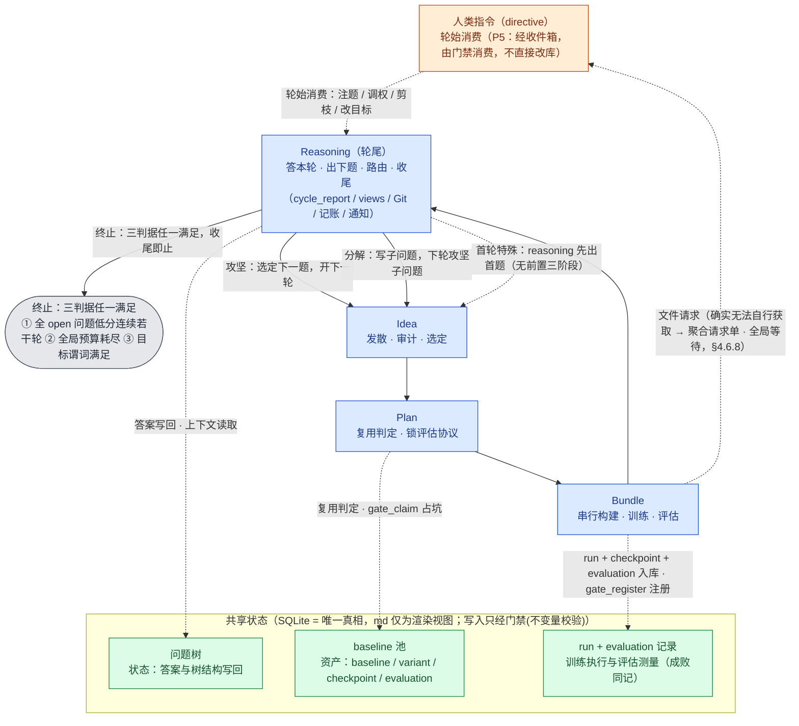

**00b 四层视图**——循环与共享状态分别落在流程层与资产层；六原则归属：P1→资产层，P2/P3→策略层与流程层边界，P5/P6→运行层：

<!-- png: 00b-四层架构 -->
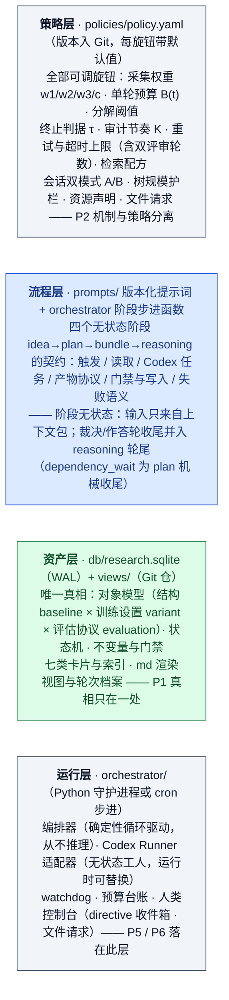

---

## 图 01 · 一轮主循环 advance(cycle) 全景（§3 §8.1）

**这张图回答**：编排器每被唤醒一次，一轮如何从开启走到收尾。要点：**每步完成即落库，下一次 advance 从断点续起（P6）**；**reasoning 是裁决与作答路径的唯一收口与收尾**（无独立 closing；dependency_wait 由 plan 机械收尾，§4.2.5）；任何阶段失败都如实入账后汇入 reasoning 收尾（P4 失败即观测）。本图为主干；**路由细分（reuse_only / eval_only / goal_amend / dependency_wait）见图04（plan 落 route）与图06g（CYCLE 状态机）**。

<!-- png: 01-主循环 -->
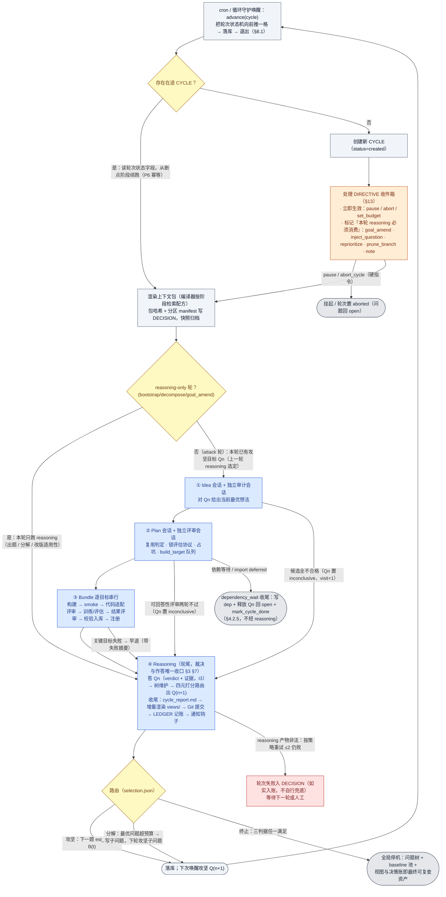

---

## 图 02 · Reasoning（轮尾）：答题 · 树维护 · 路由 · 收尾（§3 §7）

**这张图回答**：唯一的「解释证据、下结论、收尾」收口阶段内部怎么走。关键时间结构：**问题 Qn 的答案在本轮轮尾的 reasoning 产生**（用本轮 bundle 证据）；执行阶段只生产证据。I3（证据强制）在 gate_close_question 机械执行。**收尾（原 closing）并入本阶段末尾**。

<!-- png: 02-Reasoning -->
```mermaid
flowchart TD
    IN["读取（上下文包·四区）：本轮问题卡 Qn + 目标当前版全文 · 问题树局部视图 + 子树摘要卡<br/>本轮 bundle 结果（runs + evaluation + metric_results + 失败摘要）· 待消费指令 · 策略快照<br/>召回：相似结论 / 可对比 evaluation"]:::orch

    IN --> FIRST{"reasoning-only 轮？<br/>(bootstrap/decompose/goal_amend)"}:::dec
    FIRST -- "是：跳过 R1 答题" --> RO["reasoning-only 轮处理（按 route 分支）：<br/>bootstrap=建首题；decompose=对 active_question 写子问题(派生边)+decompose_count++（+父 active→open 释放+逐子 dep）+选一子问题；<br/>goal_amend=消费 directive→建 goal 新版本→open 重打分→answer_applicability 批次"]:::phase
    RO --> R3
    FIRST -- "否（attack 轮）" --> R1["R1 答题：对 Qn 给出<br/>verdict + 结论正文 + 证据引用列表（证据指向 evaluation）"]:::phase

    R1 --> V{"verdict"}:::dec
    V -- "answered / refuted" --> GATE["gate_close_question（I3 证据强制）<br/>校验每条证据真实存在：<br/>evaluation 指标 / 文献 / 已关闭子问题答案 / 人类裁定"]:::gate
    GATE -- "通过：挂证据写回问题树，问题关闭<br/>（父问题靠子答案聚合关闭，价值回传）" --> R2
    GATE -- "校验不过：退回重答（≤2，附录 C artifact_parse）" --> R1
    GATE -- "重答仍不过" --> INC
    V -- "inconclusive（证据不足 / 本轮失败）" --> INC["问题置 inconclusive（非终态、可重调度）并入账<br/>visit_count + 1"]:::fail
    INC --> R2

    R2["R2 树维护（op 词表 §4.2.4）：<br/>· 派生新候选问题 spawn_question（写明 parent 与依赖声明）<br/>· 剪枝：agent propose_prune / 人类 prune_branch——写 decision(type=prune_branch) 后置 dead_end（非 I3 evidence）<br/>· 维护旧结论 applicability（needs_revalidation/contradicted→spawn revalidate 题）<br/>· 消费 inject_question / reprioritize / prune_branch / note"]:::phase
    R2 --> AMEND{"GOAL 已改版？"}:::dec
    AMEND -- "是（reasoning-only goal_amend 轮）：重评 open + 建 answer_applicability 适用性审计<br/>不批量重开 closed，受护栏（见 §13）" --> R3
    AMEND -- "否" --> R3

    R3["R3 选择出题（产 selection，不写 route）：对 open 问题集逐个显式四元打分（全程留痕）<br/>score(q) = w1·expected_gain + w2·info_gain − w3·cost_norm<br/>+ c·√( ln N / (1+visit_count) ) + directive_adjust"]:::phase
    R3 --> SEL{"与单轮预算 B(t) 比较后定 next_intent"}:::dec
    SEL -- "最优问题 est_cost ≤ B(t)" --> ATK["next_intent=attack：选定下一题<br/>下一轮进 idea；route 由编排器据 plan 派生（attack/eval_only/reuse_only/dependency_wait）"]:::phase
    SEL -- "最优问题 est_cost > B(t)" --> DCP["next_intent=decompose：下一轮 route=decompose（reasoning-only）<br/>下一轮才写子问题、挑子问题作再下轮攻坚"]:::phase
    SEL -- "三判据任一满足" --> TER(["next_intent=terminate：编排器收尾后停机<br/>（terminate 非 route，本轮 route 不改写）"]):::term

    ATK --> FIN
    DCP --> FIN
    TER --> FIN
    FIN["R4 收尾（原 closing 并入此处）：<br/>渲染 cycle_report.md → 增量渲染 views/（树/池/目标/摘要）<br/>→ Git 提交视图仓 → LEDGER 记账聚合 CYCLE.cost_total → 通知钩子"]:::phase
    FIN --> OUT["产物协议（符合 schema 的 JSON，编排器解析校验）<br/>answer.json {question_id, verdict, answer_md, evidence[]（带 metric_result_id）}（仅 answered/refuted；首轮/inconclusive 不产）<br/>tree_ops.json {ops[] ∈ 封闭七词表 §4.2.4} · selection.json {next_question_id, next_intent∈{attack,decompose,terminate}, scores[]}（不写 route，编排器派生）"]:::orch
    OUT -- "产物非法：重试后仍败" --> RF["轮次失败入 DECISION，等待下一轮或人工"]:::fail

    classDef phase fill:#dbeafe,stroke:#1d4ed8,color:#1e3a8a
    classDef asset fill:#dcfce7,stroke:#15803d,color:#14532d
    classDef human fill:#ffedd5,stroke:#c2410c,color:#7c2d12
    classDef gate fill:#ede9fe,stroke:#6d28d9,color:#4c1d95
    classDef fail fill:#fee2e2,stroke:#b91c1c,color:#7f1d1d
    classDef term fill:#e5e7eb,stroke:#4b5563,color:#1f2937
    classDef dec fill:#fef9c3,stroke:#a16207,color:#713f12
    classDef orch fill:#f1f5f9,stroke:#475569,color:#0f172a
```

---

## 图 03 · Idea：发散 · 统一审计 · 选定（§7）

**这张图回答**：选中的问题如何变成一个当前最优的可研究想法。关键质量门：**旁路想法也必须经过同一审计提示词**——两条路共用一个门；审计的独立性 = 独立 Runner 调用、只见产物不见生产过程。

<!-- png: 03-Idea -->
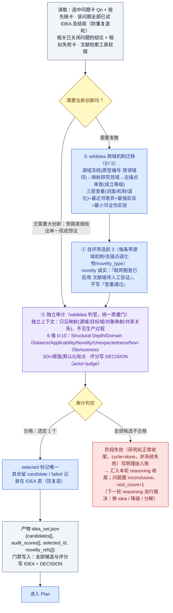

---

## 图 04 · Plan：复用四情形 · 锁评估协议（§4 §7.2）

**这张图回答**：selected idea 如何与 baseline 池发生关系，产出可执行、可回答的计划。两个关键锁：**复用规则由 plan 机械执行**（四情形）；**评估协议在此锁死，bundle 只照办不再发明**（I2 源头）。占坑互斥（I5）防止昂贵构建重复开工。`targets[] target_kind ∈ {build, exec, eval}`；import 走 `import_defer` 单独分支（deferred、不产 target，§3.6.3）。

<!-- png: 04-Plan -->
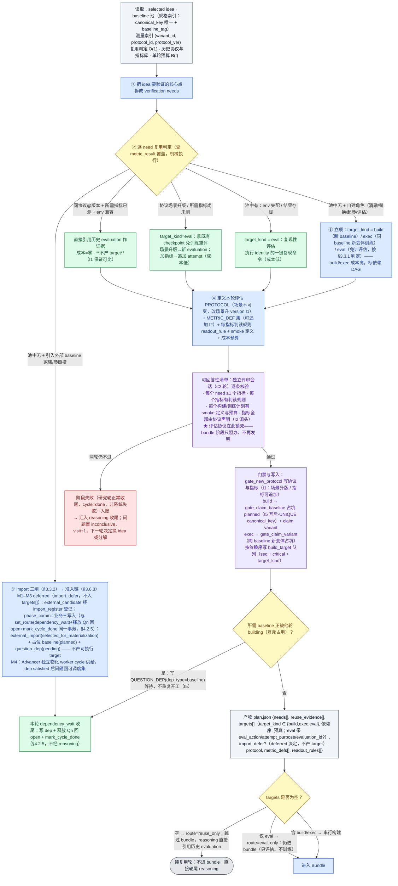

---

## 图 05 · Bundle：串行构建 · 训练 · 评估 · 注册（§7 §9）

**这张图回答**：缺失的 baseline/变体如何被合法地造出来并测量。主干 = 单个目标的生命周期（**严格串行，同一时刻只有一个在建目标**）。一次执行可产**多个 checkpoint**（如 LOSO 15 折）；评估产出 **evaluation + metric_result(fold + aggregate)**；**复制非剪切**入池。「构建完成且有结果后才入库」由 I4 机械保证。

<!-- png: 05-Bundle -->
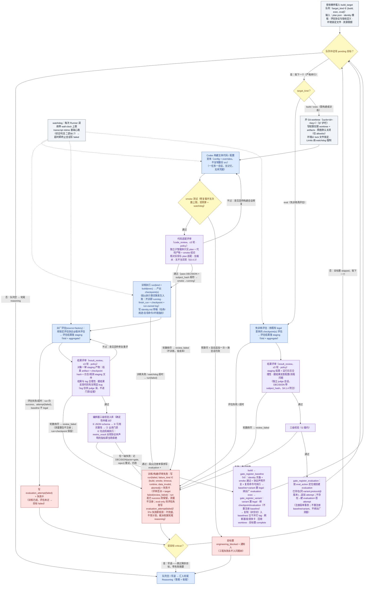

---

## 图 06 · 核心实体状态机 · 对象关系 · 机制图（§4 §9 §10 §12）

**这张图回答**：库里哪些状态迁移合法、对象之间什么关系、资产如何被召回与流转。**状态机由门禁强制：非法迁移在写库时报错**。不变量执行点：I1=gate_new_protocol、I2=metric_result 触发器、I3=gate_close_question、I4=gate_register_baseline、I5=gate_claim_baseline/variant、I6=selector 规范化+gate 校验（写 target_set_hash）、append-only=各写库点冻结约束/终态冻结触发器。

### 06a · QUESTION（问题树节点）——派生向下，关闭向上

<!-- png: 06a-QUESTION状态机 -->
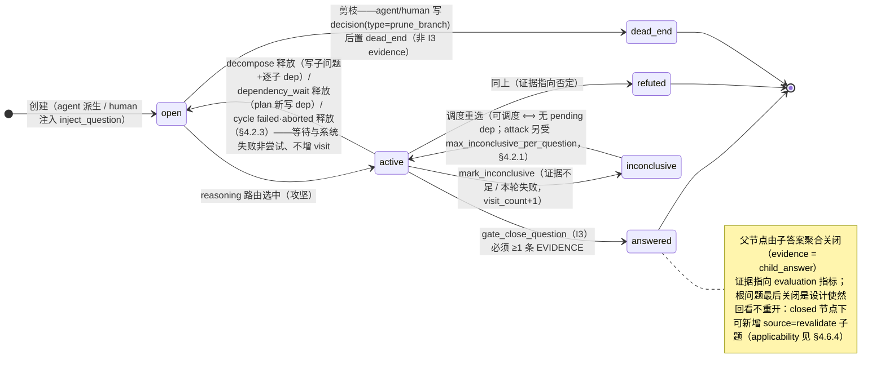

### 06b · BASELINE（结构资产）——building 即互斥锁

<!-- png: 06b-BASELINE状态机 -->
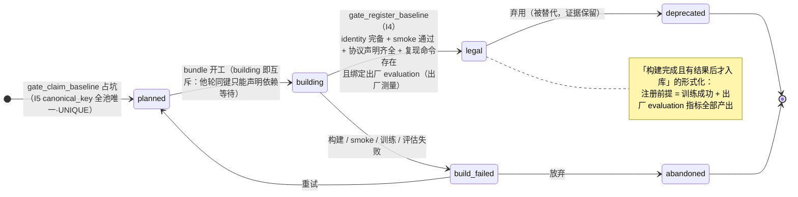

### 06c · VARIANT（结构 + 训练设置，一次执行）——append-only

<!-- png: 06c-VARIANT状态机 -->
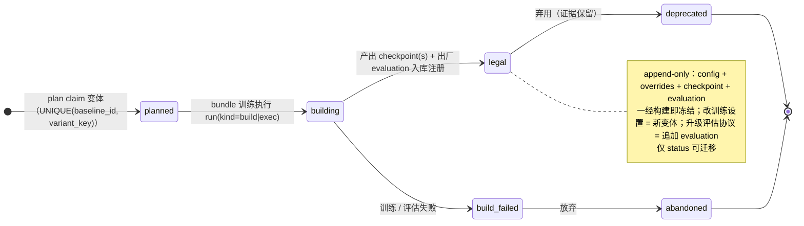

### 06d · RUN（训练执行中心事实表）——成败同记，kind ∈ {build, exec}

<!-- png: 06d-RUN状态机 -->
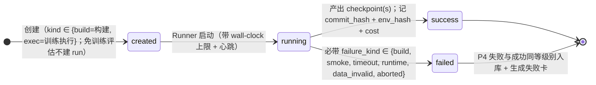

### 06e · EVALUATION（对照元：逻辑测量单元 = 变体 × 评估协议@版本）

<!-- png: 06e-EVALUATION状态机 -->
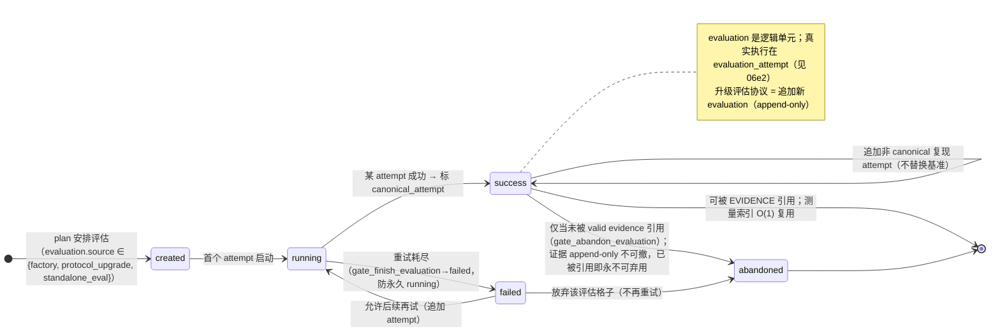

### 06e2 · EVALUATION_ATTEMPT（一次真实评估执行）——审计载体

<!-- png: 06e2-EVALUATION_ATTEMPT状态机 -->
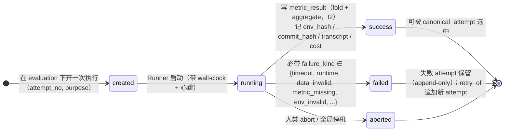

### 06f · BUILD_TARGET（bundle 串行队列）——每个状态即断点

<!-- png: 06f-BUILD_TARGET状态机 -->
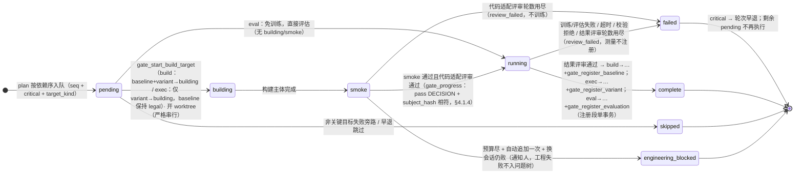

### 06g · CYCLE（一轮循环）——reasoning 是裁决与作答的唯一收口（dependency_wait 为 plan 机械收尾）

<!-- png: 06g-CYCLE状态机 -->
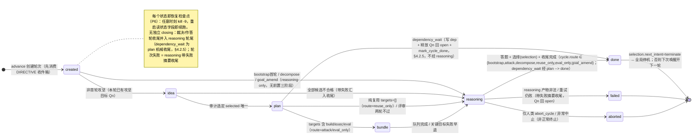

### 06h · 对象关系（三正交维度：结构 × 训练设置 × 评估协议）

**这张图回答**：对象模型的连接结构。**对照元 = evaluation**；**variant 与 protocol 之间没有边**（训练设置在 variant.config，评估协议只经 evaluation 进入）。

<!-- png: 06h-对象关系 -->
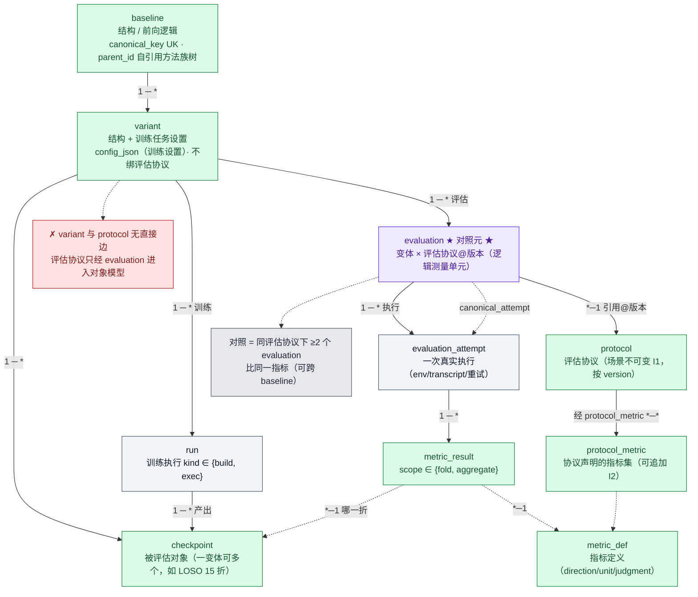

### 06i · 资产召回（渐进四级，plan 复用判定最重）

<!-- png: 06i-资产召回 -->
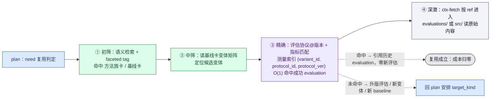

### 06j · md 文档三类生命周期

<!-- png: 06j-md生命周期 -->
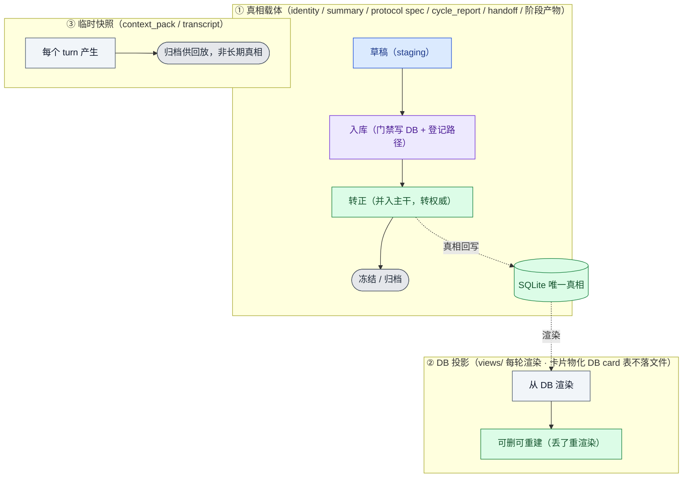

### 06k · baseline 池管理两层面（文件层 ∥ DB 层，经入库三段缝合）

<!-- png: 06k-池管理两层面 -->
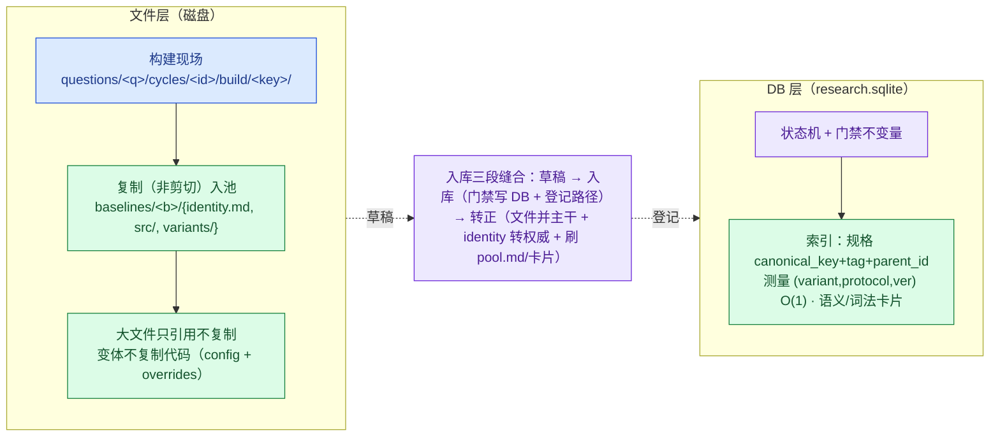

### 06l · 一轮 IO 数据流（四阶段 context_pack → 产物 → 门禁入库）

<!-- png: 06l-一轮IO数据流 -->
```mermaid
flowchart LR
    DB[("SQLite 真相")]:::asset
    DB ==> CP["上下文编译器<br/>四区包"]:::orch
    CP --> Ii["idea：问题卡+祖先+已试 idea+失败卡+文献"]:::phase
    Ii -->|"idea_set.json"| Gi["门禁→IDEA+DECISION"]:::gate
    Gi --> Pp["plan：idea+池卡+协议库+预算"]:::phase
    Pp -->|"plan.json"| Gp["门禁→protocol+占坑+build_target"]:::gate
    Gp --> Bb["bundle：计划切片+评估协议+identity 模板+env"]:::phase
    Bb -->|"variant+checkpoint+evaluation+attempt+metric_result"| Gb["门禁→复制入池"]:::gate
    Gb --> Rr["reasoning：本轮问题卡+本轮 bundle 结果+子树摘要+召回"]:::phase
    Rr -->|"answer/tree_ops/selection"| Gr["门禁→关问题+写树+收尾"]:::gate
    Gr ==> DB
    classDef phase fill:#dbeafe,stroke:#1d4ed8,color:#1e3a8a
    classDef asset fill:#dcfce7,stroke:#15803d,color:#14532d
    classDef gate fill:#ede9fe,stroke:#6d28d9,color:#4c1d95
    classDef orch fill:#f1f5f9,stroke:#475569,color:#0f172a
```

### 06m · baseline 池生命周期 ①–⑧

<!-- png: 06m-池生命周期 -->
```mermaid
flowchart TD
    S1["① 立项：结构变 → 新 baseline<br/>gate_claim_baseline(I5) planned · claim variant · build_target(build)"]:::phase
    S2["② 构建+训练+出厂评估<br/>run(build)→checkpoint(s) · evaluation+attempt+metric_result(I2) · gate_register(I4)→legal · 复制入池"]:::phase
    S3["③ 引用：某 evaluation 指标作证据<br/>EVIDENCE(question→evaluation)"]:::asset
    S4["④ 加变体：改训练设置 → 新变体(exec)<br/>run(exec)→新 checkpoint(s) · evaluation · variants/&lt;新key&gt;/"]:::phase
    S5["⑤ 升级评估协议：不动训练，拿 checkpoint 重评<br/>场景升版→新 evaluation；加指标→同 evaluation 追加 attempt"]:::phase
    S6["⑥ 复用：测量索引命中成功 evaluation → O(1) 引用，零新评估"]:::asset
    S7["⑦ 派生 baseline：结构变 → 新 baseline(parent 指原)，走 ②"]:::phase
    S8["⑧ 弃用：legal → deprecated（只标记，证据保留）"]:::term

    S1 --> S2 --> S3
    S2 --> S4
    S2 --> S5
    S4 --> S6
    S5 --> S6
    S2 --> S7
    S2 --> S8
    INV["贯穿不变量：I5 占坑① · I4 注册② · I2 测量履约②⑤ · I1 协议场景不可变⑤ · append-only ⑤⑧"]:::gate
    classDef phase fill:#dbeafe,stroke:#1d4ed8,color:#1e3a8a
    classDef asset fill:#dcfce7,stroke:#15803d,color:#14532d
    classDef gate fill:#ede9fe,stroke:#6d28d9,color:#4c1d95
    classDef term fill:#e5e7eb,stroke:#4b5563,color:#1f2937
    classDef orch fill:#f1f5f9,stroke:#475569,color:#0f172a
```

---

## 图 07 · 人类审计与介入：web + QQ + 自然语言（§13）

**这张图回答**：人如何在不破坏不变量的前提下看懂、改变系统。两原则：**人不直接改库（P5）**——经 DIRECTIVE 收件箱由门禁在指定时机消费；**人与系统记同一本账**——指令消费与系统决策同写 DECISION。三通道：web 只读仪表盘 / QQ bot 推送与收 NL / 自然语言转 directive。

<!-- png: 07-人类审计与介入 -->
```mermaid
flowchart LR
    H["人类<br/>（不直接改库 P5）"]:::human

    subgraph CHAN["三通道（借鉴 DeepScientist 异步消息队列 / channels connector / artifact.interact）"]
        direction TB
        C1["web 只读仪表盘<br/>tree.md / pool.md / goal.md / digest.md"]:::asset
        C2["QQ bot：推送（轮失败 / engineering_blocked / 每 K 轮摘要 / 文件请求三事件）<br/>+ 接收自然语言消息"]:::human
        C3["CLI / 落 directives/inbox/ JSON 文件"]:::human
    end
    H --> CHAN
    C2 --> NL["长在线中介线程（只读 Codex）：解答 query · 双向传话 ·<br/>润色用户请求 → 硬指令回显确认展示润色稿 · 软指令直接入队"]:::gate
    C3 --> DT
    NL -- "raw 原样入 interaction_message（不可变）；<br/>润色稿进 directive.payload_json" --> DT["DIRECTIVE 表 status = pending"]:::asset

    DT --> T1["立即生效（硬）：set_budget"]:::gate
    DT --> T2["阶段边界（硬）：pause / resume / abort_cycle（问题回 open）"]:::gate
    DT --> T3["下一轮 reasoning 轮始消费<br/>inject_question(软) · reprioritize(pin 硬/boost·suppress 软)<br/>prune_branch(硬，置 dead_end + decision(type=prune_branch)；非 I3 evidence) · goal_amend(硬，目标新版本) · note(软)"]:::gate

    T1 --> DEC["消费写 DECISION（人与系统同一本账）<br/>软指令 = 采集打分加成项：系统可有理由地不从，须写明理由<br/>硬指令 = 绕过权衡直接生效"]:::asset
    T2 --> DEC
    T3 --> DEC

    RQ["文件请求（§4.6.8）：阶段 sidecar resource_request.json（强制披露已尝试路径+失败原因）<br/>→ interaction_request(pending)（一 goal 一张 pending 单）→ 通知 request_pending/reminder<br/>→ 全局等待：只停研究推进，query/通知/上传校验照常"]:::gate
    RQ -.-> C2
    H -- "放文件入 uploads/&lt;request_id&gt;/&lt;item_no&gt;/ · 控制台答复 已提供/无法提供/取消" --> RQD["daemon 校验 hash 入账 → 并入 input/user_provided/&lt;request_id&gt;/（流程层只读）<br/>resolution_json + resolved_message_id → resolved/cancelled → Advancer 恢复<br/>（文件是输入资产、非 evidence；请求/答复不写 decision）"]:::asset

    T3 -- "改变研究方向" --> GA["goal_amend → GOAL 新版本（旧版不可变 G1 锚）<br/>→ 下一轮强制重评全部 open 问题 → digest 汇报方向变化"]:::phase

    subgraph AF["审计面：四入口（不读代码不查库即可看懂）"]
        direction TB
        A1["views/ 仪表盘——研究现在到哪了"]:::asset
        A2["cycle_report.md——这一轮为什么这么做"]:::asset
        A3["DECISION 可 SQL 查询（含 prompt_version）——哪一步判断偏了"]:::asset
        A4["views/ Git log 与 diff——方向怎么演化"]:::asset
        A5["status_card + live strip——现在正在跑什么（§4.6.6）"]:::asset
    end
    DEC -.-> A3
    AF -.-> H

    RPL["回放保证：上下文包快照（输入）+ 版本化提示词（程序）+ DECISION（输出）<br/>三件套归档 → 任一历史决策可重建完整输入，错误定位到『第几轮的哪次打分』"]:::gate
    A3 -.-> RPL

    classDef phase fill:#dbeafe,stroke:#1d4ed8,color:#1e3a8a
    classDef asset fill:#dcfce7,stroke:#15803d,color:#14532d
    classDef human fill:#ffedd5,stroke:#c2410c,color:#7c2d12
    classDef gate fill:#ede9fe,stroke:#6d28d9,color:#4c1d95
    classDef fail fill:#fee2e2,stroke:#b91c1c,color:#7f1d1d
    classDef term fill:#e5e7eb,stroke:#4b5563,color:#1f2937
    classDef dec fill:#fef9c3,stroke:#a16207,color:#713f12
    classDef orch fill:#f1f5f9,stroke:#475569,color:#0f172a
```

---

## 图 08 · 上下文编译与数据写回闭环（含 validate_artifact 预检环）（§5 §11）

**这张图回答**：长时运行不漂移的根。左半 = 真相之上的派生卡片层与索引（**写路径即索引维护路径，同一事务**）；右半 = 编译器四区包 → Codex 会话 → 产物经**只读预检环 + 确定性三级校验**写回，构成闭环。

<!-- png: 08-上下文编译闭环 -->
```mermaid
flowchart LR
    DB[("db/research.sqlite（WAL）<br/>唯一真相 P1：对象模型 · 状态机<br/>事实表 run / evaluation / metric_result · DECISION")]:::asset

    subgraph DRV["派生卡片层 + 索引（专为上下文供给设计）"]
        direction TB
        CARDS["七类卡片（定额预算 md 片段，物化 DB card 表，携 src_hash 可机械检出过期）<br/>问题卡 ≤200 · 子树摘要 ≤400（subtree_card_depth=1）· 方法族 ≤300 · 基线 ≤250<br/>变体 ≤150（含各 evaluation 摘要 + 反向链接）· 失败 ≤150 · 协议 ≤150"]:::asset
        IDX["索引（建在卡片层与事实表上）<br/>结构（parent_id+依赖边）· 调度（status+综合分+visit_count）<br/>词法（FTS5）· 语义（嵌入向量）· 规格（canonical_key 唯一+tag）<br/>测量（复用判定 O(1)：variant_id+protocol_id+protocol_ver）"]:::asset
    end

    DB == "门禁写路径同一事务：卡片刷新 + 摘要传播 + FTS/嵌入更新" ==> DRV

    COMP["上下文编译器（编排器内置，确定性）<br/>按阶段检索配方组装四区包：<br/>① 固定锚（任务关键集必含，不截断）② 结构邻域（受限血缘/依赖卡）<br/>③ 检索区（词法+语义+新近+状态权重 top-k）④ 引用区（ref 清单 + 取数工具）<br/>降级顺序固定：检索区 top-k 减半 → 邻域裁剪 → 报警人工"]:::orch

    DRV --> COMP
    COMP -- "确定性：同快照+同配方+同预算→字节一致<br/>包哈希+分区 manifest 写 DECISION · 快照归档 cycles/&lt;id&gt;/" --> PACK["context_pack/（只读目录）"]:::orch

    PACK --> CODEX["Codex 会话（Runner 窄接口 run_task）<br/>一任务一会话、会话无记忆（P1/P6）· 无库凭据、无 views/ 写权限<br/>MCP 只读工具：ctx-fetch 按需深潜 · 文献检索 · validate_artifact 预检"]:::phase

    CODEX -. "① 只读预检（实时反馈，不写库）<br/>validate_artifact：自查 schema / 引用完整性" .-> PRECHK["MCP validate_artifact（只读）"]:::gate
    PRECHK -. "反馈问题，会话内自改" .-> CODEX

    CODEX -- "产物（schema JSON + md 正文）落 artifacts/ staging，原子改名提交" --> VAL["② 编排器三级校验（事务内重校验，确定性仲裁）<br/>schema → 引用完整性 → 业务门禁（预检结论不被信任，真相侧再验）"]:::gate
    VAL -- "任一级失败：记 DECISION(actor=gate, reject) 重试 ≤2 → 升级阶段失败" --> CODEX
    VAL -- "通过" --> GW["门禁函数 gate_*（不变量校验）= 资产层唯一写入口"]:::gate
    GW == "写回真相，同一事务刷新卡片与索引（闭环）" ==> DB

    classDef phase fill:#dbeafe,stroke:#1d4ed8,color:#1e3a8a
    classDef asset fill:#dcfce7,stroke:#15803d,color:#14532d
    classDef human fill:#ffedd5,stroke:#c2410c,color:#7c2d12
    classDef gate fill:#ede9fe,stroke:#6d28d9,color:#4c1d95
    classDef fail fill:#fee2e2,stroke:#b91c1c,color:#7f1d1d
    classDef term fill:#e5e7eb,stroke:#4b5563,color:#1f2937
    classDef dec fill:#fef9c3,stroke:#a16207,color:#713f12
    classDef orch fill:#f1f5f9,stroke:#475569,color:#0f172a
```

---

## 图 09 · 长时运行：恢复 · watchdog · 预算 · 停机（§6 §8）

**这张图回答**：数百轮无人值守怎么不挂、不烧穿预算、何时停。三套机制：**阶段边界即检查点**（步进函数幂等，kill -9 安全）；**watchdog 绝不无限重试**；**预算台账一处记账三处消费**。会话双模式 A/B 在 M6 实测定默认。

<!-- png: 09-长时运行 -->
```mermaid
flowchart TD
    CRON["运行形态（§8.1）：cron / 循环守护 + advance 步进<br/>每次唤醒推进一格 → 落库 → 退出（与幂等恢复天然契合）<br/>会话双模式：A 一 turn 一阶段 / B 一 turn 跨多阶段 Codex 自决何时停"]:::orch
    CRON --> IDEM{"幂等检查：该阶段产物与 DECISION 已存在？"}:::dec
    IDEM -- "存在：跳过该步" --> NXT["推进到下一阶段"]:::orch
    IDEM -- "不存在：执行" --> EXEC["执行阶段步进函数<br/>半成品只写 staging → 完成后原子改名"]:::phase
    EXEC --> CKPT["落库（阶段边界即检查点 §8.4）"]:::asset
    NXT --> CRON
    CKPT --> CRON

    KILL["⚡ 任意时刻 kill -9 / 断电 / 崩溃"]:::fail
    KILL -.-> RCV["重启：编排器读在途 CYCLE 状态字段从该阶段继续<br/>（P1 全状态在库）· 验收 M3：杀进程重启续跑终态与不杀一致"]:::orch
    RCV -.-> CRON

    subgraph WDG["watchdog 与挂死处理（§8.2）"]
        direction TB
        W1["每次 Runner 调用带 wall-clock 上限（探针级 2h / 全量级默认 24h）<br/>transcript mtime 作基础心跳（综合判活 二部§6.7）"]:::orch
        W1 -- "超时" --> W2["终止会话 → 写 failed → 按重试策略<br/>（smoke 修复受预算上限 / 产物解析 ≤2 / plan 评审 ≤2 / bundle 双评审各 ≤3）"]:::fail
        W2 -- "连续同型失败超上限" --> W3["轮次失败 + 通知人类——绝不无限重试"]:::fail
    end
    WDG -.-> CKPT

    subgraph BUD["预算台账（§8.3）"]
        direction TB
        L1["每次 Runner 调用与每个 run/evaluation 的消耗记入 LEDGER"]:::asset
        L1 --> L2["按轮聚合到 CYCLE.cost_total"]:::asset
        L2 --> L3["三处消费：① 采集成本项 cost_norm<br/>② 单轮预算 B(t)：初值≈廉价探针，每 m 轮 ×2 封顶 B_max<br/>③ 全局预算耗尽判停（上限改动只能人类 set_budget）"]:::orch
    end
    CKPT -.-> L1

    L3 --> STOPQ{"终止三判据（任一触发即出环）"}:::dec
    STOPQ -- "① 全 open 问题 score < τ 连续若干轮" --> STOP
    STOPQ -- "② 全局预算耗尽" --> STOP
    STOPQ -- "③ 目标谓词满足（reasoning 判定 + 人类确认）" --> STOP
    STOPQ -- "未触发：继续循环" --> CRON
    STOP(["全局停机：问题树 + baseline 池 + 视图与决策账<br/>即最终可复查资产（任何结论都能回溯到一次具体 evaluation 测量）"]):::term

    subgraph STG["存储治理与时间线（§8）"]
        S1["SQLite WAL：每轮收尾后滚动备份 · views/ 独立 Git 仓每轮一提交（git log 即研究时间线）<br/>档案分级：metrics 与产物 JSON 永存 · 原始日志压缩归档 · worktree 注册后回收<br/>schema 迁移 db/migrations/（升级前自动备份）· 提示词版本号记入 DECISION"]:::asset
    end
    CKPT -.-> STG
    W3 -.-> NOTI["通知钩子（webhook / QQ）：轮次失败 · engineering_blocked · 每 K 轮摘要 · 文件请求三事件"]:::human

    classDef phase fill:#dbeafe,stroke:#1d4ed8,color:#1e3a8a
    classDef asset fill:#dcfce7,stroke:#15803d,color:#14532d
    classDef human fill:#ffedd5,stroke:#c2410c,color:#7c2d12
    classDef gate fill:#ede9fe,stroke:#6d28d9,color:#4c1d95
    classDef fail fill:#fee2e2,stroke:#b91c1c,color:#7f1d1d
    classDef term fill:#e5e7eb,stroke:#4b5563,color:#1f2937
    classDef dec fill:#fef9c3,stroke:#a16207,color:#713f12
    classDef orch fill:#f1f5f9,stroke:#475569,color:#0f172a
```

---

*生成于 2026-06-17 · 源文档：《meta-research 元循环系统 · 施工说明书 v2.2》· 本文件为唯一图源，HTML 与 PNG 均由此渲染。*
